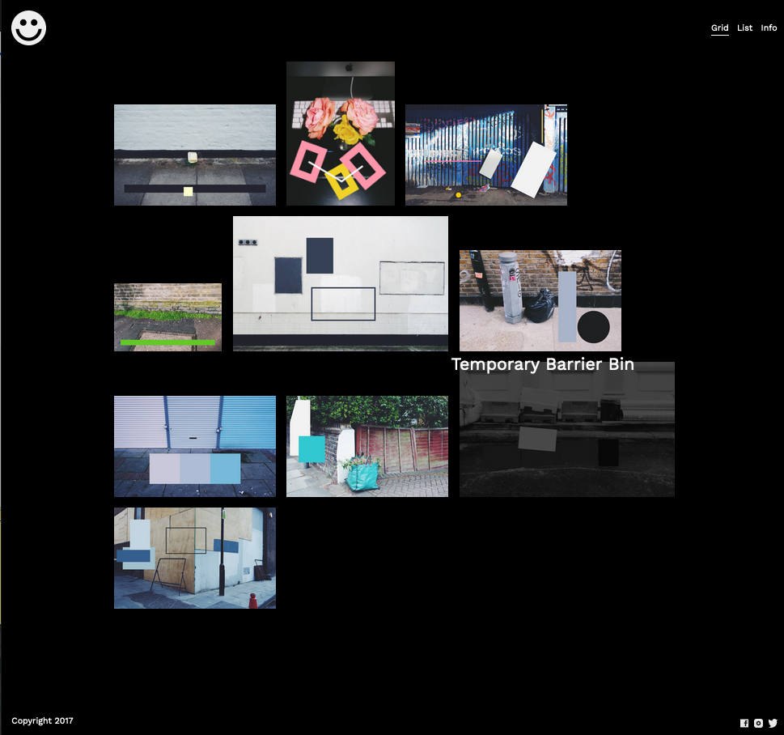

# Boyce-1

Building this responsive site I have learned different styles of layout with positioning and flexbox.

Check this site [here](https://boyce-week4-4.superhi.com)

Background color : #000000
Text color : #fffffff
Border unselected : transparent
Border unselected hover : #333333
Border selected : #ffffff
Border selected hover : #ffe300
Typefaces : Work Sans

 
 

